# A repository of my QMDs

This repository contains multiple QMD xovi extensions that are QoL improvements for the xochitl interface.
QMDs in this repo add a quicktools-like floating bar, a layer management bar, and multiple gestures.
Any bugs should be reported in the [issues tab](https://github.com/FouzR/xovi-extensions/issues).

As this project is done entirely in my free time, I'd appreciate support via Ko-Fi :)

## Install

### Vellum

These QMDs can be installed with [vellum](https://github.com/vellum-dev/vellum-cli) and [reManager](https://github.com/rmitchellscott/reManager): <https://vellum.delivery/#/author/FouzR>.

### Manual

1. [Install xovi](https://github.com/asivery/rm-xovi-extensions#to-install-xovi)
2. Download QMDs you want to install from the folder corresponding to your software version
3. Copy the downloaded files to `/home/root/xovi/exthome/qt-resource-rebuilder/` on the tablet
4. Restart xovi

## QMDs

### floating.qmd

<https://github.com/user-attachments/assets/11d06798-b3d4-431b-bd93-c7b086f8f4d7>

<https://github.com/user-attachments/assets/12eaf70f-c224-40ab-af33-20786b46cd01>

Adds a floating toolbar with the following features:

- Allows adding any tool with a preset colour and thickness
- Allows adding just a tool, or thickness, or colour option (3.25 and above)
- Allows changing the added tool order
- Can be placed anywhere in the screen
- Can be minimised when not in use
- Snaps to the edges and horizontal/vertical center of the screen when moved
- Config persists between restarts (enabled state, position, tools list)
- Three presets to change between
- Floating layers menu fully replaces the system equivalent, except for renaming the layer
- Changes to a vertical bar when moved to the left/right edge of the screen

See the [floating toolbar](#floating-toolbar) section of this readme for more.

### gestures.qmd

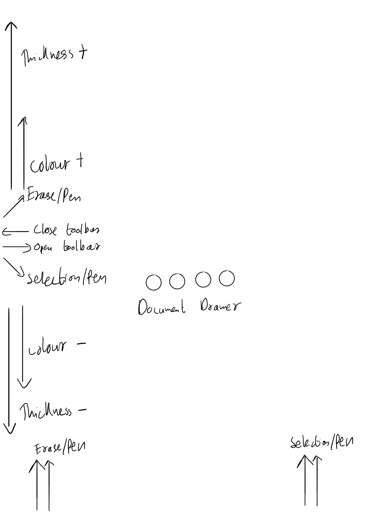

> [!NOTE]
> These have only been tested in right-handed mode.
> Festures on the edge are mirrored when left-handed, and change according to toolbar position.

Adds multiple gestures that are nice-to-have:

- Swipe on left edge of the page to open/close the toolbar (towards the edge to close, from the edge to open)
- Swipe with two-fingers from the left half of the bottom edge to swaps between pen and eraser
- Swipe with two-fingers from the right half of the bottom edge to swaps between pen and selection tool
- Four-finger tap to open the document drawer
- The toolbar edge while in fullscreen has multiple gestures:
    - Long swipe up/down to change thickness
    - Short swipe up/down to change colour depending on configuration in accessibility settings
    - Diagonal swipe up from the middle of the edge swaps between pen and eraser
    - Diagonal swipe down from the middle of the edge swaps between pen and selection tool

### gestureColourSettings.qmd

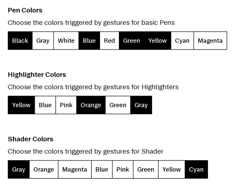

Adds a menu in accessibility to choose which colours to swap between with pens, highlighters, and shaders when using [gestures.qmd](#gesturesqmd).

### favTagButton.qmd

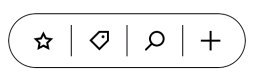

Adds buttons to the navigator search/new note button that lets you open the favourites and tagged view with a click.

### selectionStuff.qmd

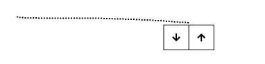

Adds the ability to select everything above the line

### toolbar_icon.qmd

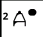

Adds an icon with current tool, thickness, and colour in place of the toolbar-expand button while the toolbar is hidden

## Deprecated

### selectionErase.qmd

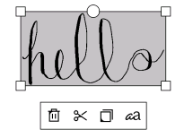

> [!NOTE]
> This feature is in the default interface since 3.27.

Adds the ability to delete a stroke once selected by the selection tool.

### recentsTagged.qmd

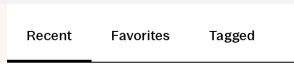

> [!NOTE]
> Only available for 3.22 and below.

Adds a new menu to the document drawer that shows only tagged files, sorted by last modified.

## Floating toolbar

### Moving the toolbar

Press and hold the left-most icon, then drag the icon to move it around. The toolbar will turn partially blank to improve refresh speeds while moving around.

### Adding a tool

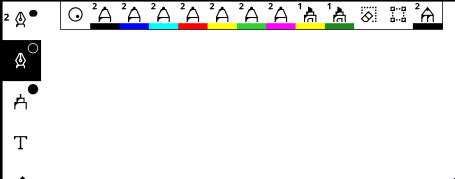

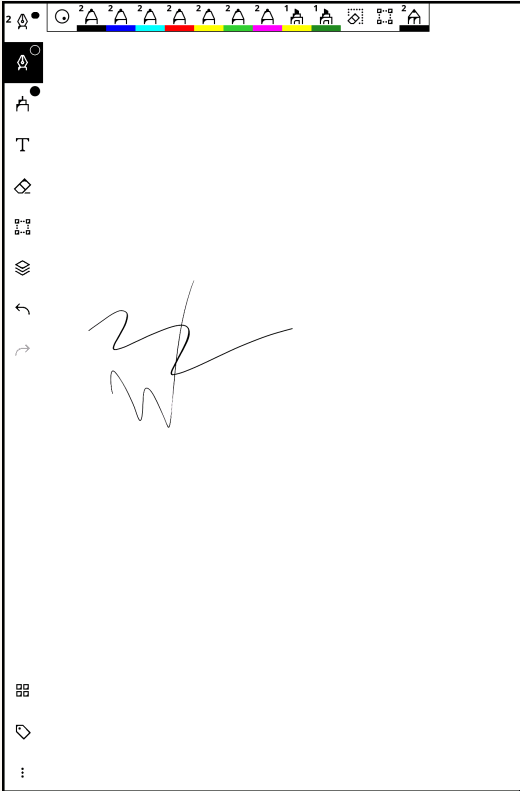

Press and hold the tool on the main toolbar to add or remove it from the floating toolbar.

> [!NOTE]
> Undo and redo can only be added when available, and need to be pressed and held on the floating toolbar to remove.

On 3.25 and above, you can add intividual tools, thicknesses, and colours directly from the submenu.

### Changing tool order

To change the tool order, press and hold on any tool button(s) to display arrows, and change the order using them.

> [!NOTE]
> The arrows won't show up unless you have the main toolbar open.

### Minimizing

Press and hold the left-most icon.

### Images

#### Menu

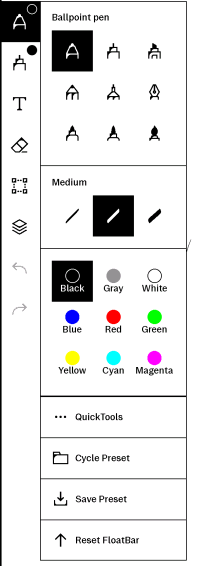

#### Layers menu

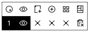

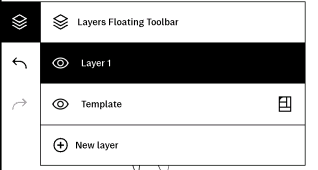

#### Change tool order

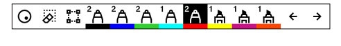

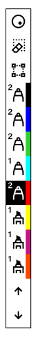

#### In fullscreen

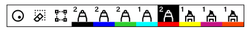

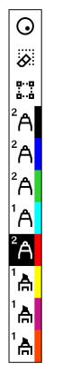

#### Minimized

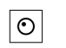
