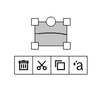
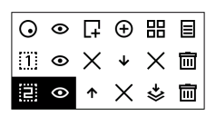

# A repository of xovi extensions

This Repo consists of multiple Xovi(.qmd) extensions that are QoL improvements to the xochitl interface. This **needs** qt-resource-rebuilder.so to work.

Download the extensions from the corresponding folders to avoid issues. 

The QMD files in this repo add a quicktools-like floating bar, layer management bar, and multiple gestures 
Instructions to install xovi can be found in [here](https://github.com/asivery/rm-xovi-extensions/tree/master?tab=readme-ov-file#to-install-xovi)

After which, copy the files to `/home/root/xovi/exthome/qt-resource-rebuilder/` and restart xovi. 

These QMDs were tested to work in 3.15-3.25. Any bugs should be reported in the repo issues. 

As this project is done entirely in my free time, I'd appreciate support via ko-fi :) 

## Extensions

### 1. selectionErase.qmd
- Adds the ability to delete a stroke once selected by the selection tool.
  

### 2. favTagButton.qmd
- Adds 2 extra buttons to the search/new note floating button on the file explorer that lets you
open the favourites and tagged view with a click.

### 3. gestures.qmd
- Adds a couple of gestures that are nice-to-have(Note: These have only been tested on right-handed mode. So left-handed mode would behave slightly differently)
1. Swipe on left edge of the page to open/close the toolbar(Swipe towards the edge to close it, swipe from the edge to open it)
2. Swipe with two-fingers from the left half of the bottom-edge to swap between eraser and pen
3. Swipe with two-fingers from the right half of the bottom-edge to swap between selection tool and pen
4. 4-Finger tap to open the document drawer
5. The edge while in fullscreen has multiple gestures. 
	1. Long swipe up/down changes thickness
	2. Short swipe up/down changes colour depending on the config
	3. Diagonal swipe up from the middle of the edge swaps between Eraser tool and pen
	4. Diagonal swipe down from the middle of the edge swaps between Selection tool and pen

> **_NOTE:_**  The gestures on the edge are mirrored when left-handed, and changes according to toolbar position 

### 4. recentsTagged.qmd
#### ONLY AVAILABLE ON 3.22 AND BEFORE
- Adds a new menu to the document drawer that shows only tagged files, sorted by last modified

### 5. selectionStuff.qmd
- Adds the ability to select everything above the line

### 6. floating.qmd
- Allows adding any tool with a preset colour and thickness
- Allows changing the added tool order
- Can be placed anywhere in the screen
- Can be minimised when not in use
- Snaps to the edges and horizontal/vertical center of the screen when moved
- Config persists between restarts(Enabled state, position, tools list)
- 3 Presets of tools to change to
- Floating Layers menu fully replaces system equivalent except for renaming the layer
- Changes to a vertical bar when moved to the left/right edge of the screen

### 7. toolbar_icon.qmd
- Adds an icon with current tool, thickness, and colour in place of the toolbar-expand button while the toolbar is hidden

### 8. gestureColourSettings.qmd
- A menu in accessibility menu to choose which colours to swap between with Pens, highlighters, or shaders

#### Moving the toolbars
##### Press and hold the left-most icon, then drag the icon to move it around. The toolbar will turn partially blank to improve refresh speeds while moving it around

#### To add a tool
Press and hold the tool on the main toolbar to add/remove from the floating toolbar. 
> **_NOTE:_**  Undo/Redo can only be added when it's available, and needs to be pressed and held on the floating toolbar to be removed

#### To change tool order
To change the tool order, press and hold on any tool button(s) to show the arrows, and change the order using them.
Note: The arrows won't show up unless you have the base toolbar open.

#### To Minimize
Press and hold the left-most icon

*Menu*

*Layer menu*

*Toolbar Default*

*Toolbar tool order change*

*Toolbar while in fullscreen*

*Toolbar when near the side edges*

*Change Order Buttons*

*fullscreen*

*Minimized*
